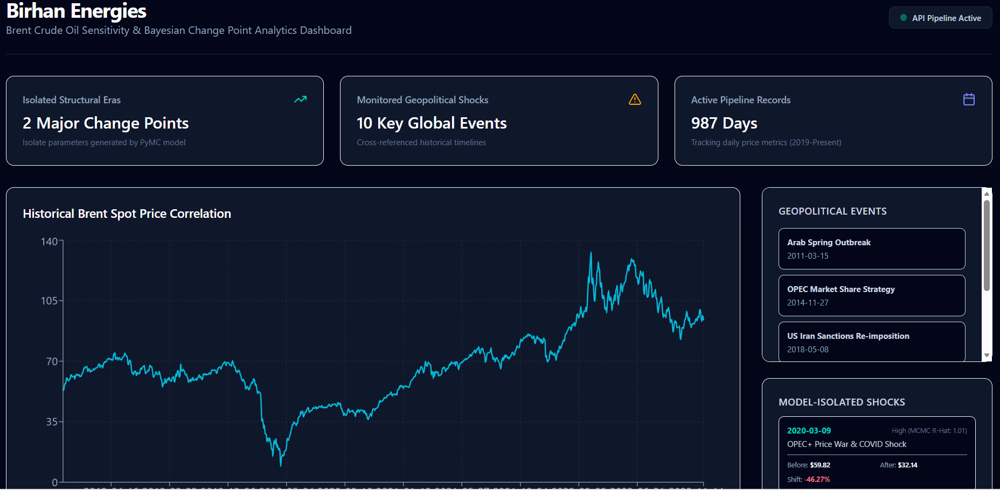
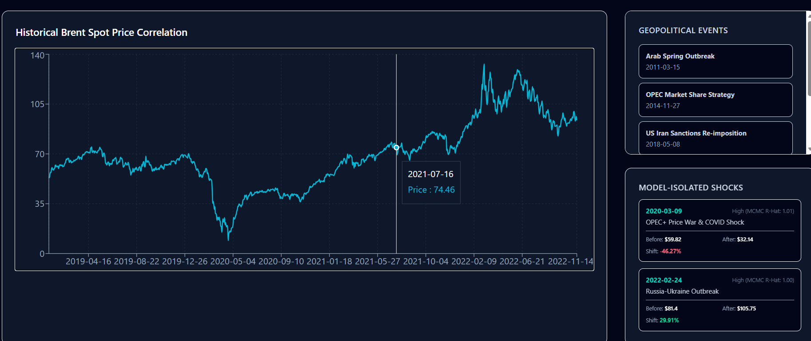

# Birhan Energies: Brent Crude Oil Quantitative Analytics & Structural Break Dashboard

An end-to-end quantitative analytics platform designed to model, analyze, and visualize the structural impacts of major geopolitical and economic events on Brent Crude oil prices from 2019 to the present.

This repository features a robust data engineering pipeline, advanced Bayesian structural break inference utilizing PyMC, and a high-performance interactive dashboard built with React and Flask.

---

## 🚀 Key Features

* **Data Engineering & Statistical Baseline:** Cleansed daily spot prices, evaluated time-series stationarity using Augmented Dickey-Fuller (ADF) tests, and engineered features (such as daily log returns).
* **Bayesian Change Point Detection:** Utilizes **PyMC** and Markov Chain Monte Carlo (MCMC) NUTS sampling to isolate structural eras and calculate statistical change points before/after major global shocks.
* **Modern Full-Stack Dashboard:**
  * **Frontend:** Built with React, Vite, **Tailwind CSS v4** (lightning-fast Rust-based styling engine), and **Recharts** for highly interactive, fluid timelines.
  * **Backend:** A lightweight Flask API serving clean, structured endpoints with handled CORS policies.

---

## 🛠️ Tech Stack

* **Backend / Quantitative Modeling:** Python 3.12+, Flask, PyMC, Pandas, NumPy, Statsmodels
* **Frontend UI:** React 18, Vite, Tailwind CSS v4, Recharts, Lucide Icons
* **Workflow & Version Control:** Git, GitHub

---

## 📂 Repository Structure

```text
├── backend/
│   ├── app.py                     # Flask API Server (Port 5001)
│   └── requirements.txt           # Backend dependencies
├── frontend/
│   ├── src/
│   │   ├── App.jsx                # React interactive dashboard source
│   │   ├── index.css              # Tailwind CSS directives & imports
│   │   └── main.jsx
│   ├── package.json               # Node packages (recharts, lucide-react)
│   ├── postcss.config.js          # Tailwind v4 PostCSS adapter configuration
│   └── vite.config.js
├── data/
│   └── raw/                       # Historical price CSVs and event sheets
├── src/
│   ├── run_change_point.py        # Bayesian change point model runner
└── README.md                      # Project documentation
1. Start the Flask Backend
Open a PowerShell window, navigate to the backend folder, install dependencies, and run the server:

PowerShell
cd backend
pip install -r requirements.txt
python app.py
The server will initialize on http://localhost:5001.

2. Run the React Frontend Dashboard
Open a second PowerShell tab/window, navigate to the frontend folder, install dependencies, and launch Vite:

PowerShell
cd frontend
npm install
npm run dev
Open http://localhost:5173 in your browser to view the live dashboard.
 🧠 Quantitative Methodology & Model Assumptions

 Bayesian Change Point Detection (Task 2)
Our structural break analysis assumes that Brent Crude oil price returns follow distinct statistical regimes partitioned by major geopolitical/economic shocks.
Model Likelihood: We assume daily log returns $r_t$ are normally distributed:
  $$r_t \sim \text{Normal}(\mu_s, \sigma_s)$$
  where the active regime $s$ (before or after a break) determines the mean and variance parameters.
Priors: We define weak conjugate priors on the regime transition times (change points) over the time-series index:
  $$\tau \sim \text{DiscreteUniform}(0, T)$$
MCMC Sampling:Using PyMC's No-U-Turn Sampler (NUTS), we draw 2,000 posterior samples with a 1,000-sample burn-in to verify convergence. Convergence diagnostics are verified using Gelman-Rubin ($\hat{R} < 1.05$) statistics.
🖥️ Dashboard Interface & Interactive Controls

Our analytical dashboard is built for active decision-making, allowing users to cross-reference quantitative model outputs with real-world qualitative events.

Main Analytics Interface
A high-performance dark-mode interface tracking active pipeline days and statistical anomalies.*


Geopolitical Event Correlation & Interactive Filtering
Clicking any tracked event projects a temporal reference line directly across the price timeline, dynamically calculating and visualizing localized impact.*


